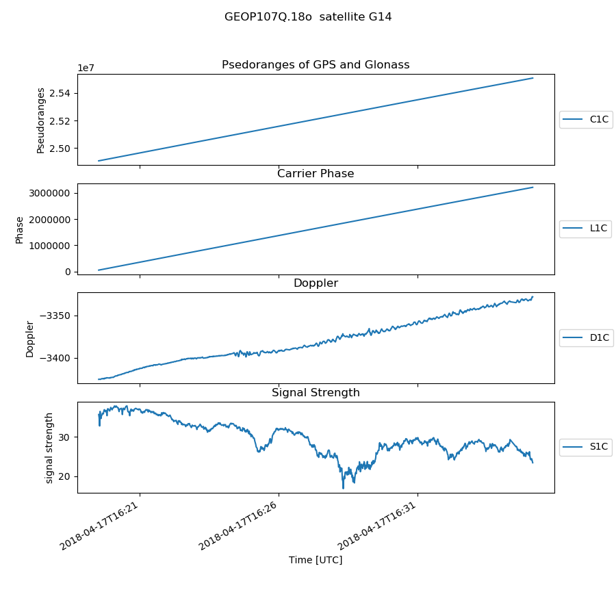

# GeoRinex

[](https://doi.org/10.5281/zenodo.2580306)

[](http://pepy.tech/project/georinex)

RINEX 3 and RINEX 2 reader and batch conversion to NetCDF4 / HDF5 in Python or Matlab.
Batch converts
[NAV](./Readme_NAV.md)
and
[OBS](./Readme_OBS.md)
GPS RINEX (including Hatanaka compressed OBS) data into
[xarray.Dataset](http://xarray.pydata.org/en/stable/api.html#dataset)
for easy use in analysis and plotting.
This gives remarkable speed vs. legacy iterative methods, and allows for HPC / out-of-core operations on massive amounts of GNSS data.
GeoRinex has over 125 unit tests driven by Pytest.

Pure compiled language RINEX processors such as within Fortran NAPEOS give perhaps 2x faster performance than this Python program--that's pretty good for a scripted language like Python!
However, the initial goal of this Python program was to be for one-time offline conversion of ASCII (and compressed ASCII) RINEX to HDF5/NetCDF4,
where ease of cross-platform install and correctness are primary goals.



## Input data types

* RINEX 3.x or RINEX 2.x
  * NAV
  * OBS
* Plain ASCII or seamlessly read compressed ASCII in:
  * `.gz` GZIP
  * `.Z` LZW
  * `.bz2` bzip2
  * `.zip`
* Hatanaka compressed RINEX (plain `.crx` or `.crx.gz` etc.)
* Python `io.StringIO` text stream RINEX

Also SP3 ephemeris:

* SP3-a
* [SP3-c](ftp://igs.org/pub/data/format/sp3c.txt)
* [SP3-d](ftp://ftp.igs.org/pub/data/format/sp3d.pdf)

## Output

* File: NetCDF4 (subset of HDF5), with `zlib` compression.
This yields orders of magnitude speedup in reading/converting RINEX data and allows filtering/processing of gigantic files too large to fit into RAM.
* In-memory: Xarray.Dataset. This allows all the database-like indexing power of Pandas to be unleashed.

## Install

Latest stable release:

```sh
pip install georinex
```

Current development version:

```sh
git clone https://github.com/geospace-code/georinex

cd georinex

python -m pip install -e .
```

### Selftest

It can be useful to check the setup of your system with:

```sh
python -m pytest
```

```
158 passed, 1 skipped
```

## Usage

The simplest command-line use is through the top-level `python -m georinex.read` script.
Normally you'd use the `-p` option with single files to plot, if not converting.

* Read single RINEX3 or RINEX 2 Obs or Nav file:
  ```sh
  python -m georinex.read myrinex.XXx
  ```
* Read NetCDF converted RINEX data:
  ```sh
  python -m georinex.read myrinex.nc
  ```
* Batch convert RINEX to NetCDF4 / HDF5 (this example for RINEX 2 OBS):
  ```sh
  python -m georinex.rinex2hdf5 ~/data "*o" -o ~/data
  ```
  in this example, the suffix `.nc` is appended to the original RINEX filename: `my.15o` => `my.15o.nc`

By default all plots and status messages are off, unless using the `-p` option to save processing time.

It's suggested to save the GNSS data to NetCDF4 (a subset of HDF5) with the `-o`option,
as NetCDF4 is also human-readable, yet say 1000x faster to load than RINEX.

You can also of course use the package as a python imported module as in
the following examples. Each example assumes you have first done:

```python
import georinex as gr
```

### Time limits

Time bounds can be set for reading -- load only data between those time bounds:

```sh
--tlim start stop
```

option, where `start` and `stop` are formatted like `2017-02-23T12:00`

```python
dat = gr.load('my.rnx', tlim=['2017-02-23T12:59', '2017-02-23T13:13'])
```

## read RINEX

This convenience function reads any possible format (including compressed, Hatanaka) RINEX 2/3 OBS/NAV or `.nc` file:

```python
obs = gr.load('tests/demo.10o')
```

## Analysis

A significant reason for using `xarray` as the base class of GeoRinex is that big data operations are fast, easy and efficient.
It's suggested to load the original RINEX files with the `-use` or `use=` option to greatly speed loading and conserve memory.

A copy of the processed data can be saved to NetCDF4 for fast reloading and out-of-core processing by:

```python
obs.to_netcdf('process.nc', group='OBS')
```

`georinex.__init.py__` shows examples of using compression and other options if desired.

### Join data from multiple files

Please see documentation for `xarray.concat` and `xarray.merge` for more details.
Assuming you loaded OBS data from one file into `obs1` and data from another file into `obs2`, and the data needs to be concatenated in time:

```python
obs = xarray.concat((obs1, obs2), dim='time')
```

The `xarray.concat`operation may fail if there are different SV observation types in the files.
you can try the more general:

```python
obs = xarray.merge((obs1, obs2))
```

### Receiver location

While `APPROX LOCATION XYZ` gives ECEF location in RINEX OBS files, this is OPTIONAL for moving platforms.
If available, the `location` is written to the NetCDF4 / HDF5 output file on conversion.
To convert ECEF to Latitude, Longitude, Altitude or other coordinate systems, use
[PyMap3d](https://github.com/scivision/pymap3d).

Read location from NetCDF4 / HDF5 file can be accomplished in a few ways:

* `python -m georinex.loc` to load and plot all RINEX and .nc files in a directory
* using `xarray`

  ```python
  obs = xarray.open_dataset('my.nc)

  ecef = obs.position
  latlon = obs.position_geodetic  # only if pymap3d was used
  ```
* Using `h5py`:

  ```python
  with h5py.File('my.nc') as f:
      ecef = h['OBS'].attrs['position']
      latlon = h['OBS'].attrs['position_geodetic']
  ```

## Convert to Pandas DataFrames

Although Pandas DataFrames are 2-D, using say `df = nav.to_dataframe()` will result in a reshaped 2-D DataFrame.
Satellites can be selected like `df.loc['G12'].dropna(0, 'all')` using the usual
[Pandas Multiindexing methods](http://pandas.pydata.org/pandas-docs/stable/advanced.html).

## Benchmark

An Intel Haswell i7-3770 CPU with plain uncompressed RINEX 2 OBS processes in about:

* [6 MB file](ftp://data-out.unavco.org/pub/rinex/obs/2018/021/ab140210.18o.Z): 5 seconds
* [13 MB file](ftp://data-out.unavco.org/pub/rinex/obs/2018/021/ab180210.18o.Z): 10 seconds

This processing speed is about within a factor of 2 of compiled RINEX parsers, with the convenience of Python, Xarray, Pandas and HDF5 / NetCDF4.

OBS2 and NAV2 currently have the fast pure Python read that has C-like speed.

### Obs3

OBS3 / NAV3 are not yet updated to new fast pure Python method.

On Haswell laptop:

```sh
time python -m georinex.read tests/CEDA00USA_R_20182100000_23H_15S_MO.rnx.gz -u E
```

> real 48.6 s

```sh
time python -m georinex.read tests/CEDA00USA_R_20182100000_23H_15S_MO.rnx.gz -u E -m C1C
```

> real 17.6 s

### Profiling

using

```sh
conda install line_profiler
```

and `ipython`:

```ipython
%load_ext line_profiler

%lprun -f gr.obs3._epoch gr.load('tests/CEDA00USA_R_20182100000_23H_15S_MO.rnx.gz', use='E', meas='C1C')
```

shows that `np.genfromtxt()` is consuming about 30% of processing time, and `xarray.concat` and xarray.Dataset` nested inside `concat` takes over 60% of time.

## Notes

* RINEX 3.03 [specification](ftp://igs.org/pub/data/format/rinex303.pdf)
* RINEX 3.04 [specification (Dec 2018)](ftp://igs.org/pub/data/format/rinex304.pdf)
* RINEX 3.04 [release notes](ftp://igs.org/pub/data/format/rinex304-release-notes.pdf)

* GPS satellite position is given for each time in the NAV file as Keplerian parameters, which can be [converted to ECEF](https://ascelibrary.org/doi/pdf/10.1061/9780784411506.ap03).
* https://downloads.rene-schwarz.com/download/M001-Keplerian_Orbit_Elements_to_Cartesian_State_Vectors.pdf
* http://www.gage.es/gFD

### Number of SVs visible

With the GNSS constellations in 2018, per the
[Trimble Planner](https://www.gnssplanning.com/)
the min/max visible SV would be about:

* Maximum: ~60 SV maximum near the equator in Asia / Oceania with 5 degree elev. cutoff
* Minimum: ~6 SV minimum at poles with 20 degree elev. cutoff and GPS only

### RINEX OBS reader algorithm

1. read overall OBS header (so we know what to expect in the rest of the OBS file)
2. fill the xarray.Dataset with the data by reading in blocks -- another key difference from other programs out there, instead of reading character by character, I ingest a whole time step of text at once, helping keep the processing closer to CPU cache making it much faster.

### Data

For
[capable Android devices](https://developer.android.com/guide/topics/sensors/gnss.html),
you can
[log RINEX 3](https://play.google.com/store/apps/details?id=de.geopp.rinexlogger)
using the built-in GPS receiver.

UNAVCO [site map](https://www.unavco.org/instrumentation/networks/map/map.html#/): identify the 4-letter callsign of a station, and look in the FTP sites below for data from a site.

UNAVCO RINEX 3 data:

* OBS: ftp://data-out.unavco.org/pub/rinex3/obs/
* NAV: ftp://data-out.unavco.org/pub/rinex3/nav/

UNAVCO RINEX 2 data:

* OBS: ftp://data-out.unavco.org/pub/rinex/obs/
* NAV: ftp://data-out.unavco.org/pub/rinex/nav/

### Hatanaka compressed RINEX .crx

The compressed Hatanaka `.crx` or `.crx.gz` files are supported seamlessly via `crx2rnx`.
These are distinct from the supported `.rnx`, `.gz`, or `.zip` RINEX files.

Hatanaka, Y. (2008), A Compression Format and Tools for GNSS Observation Data, Bulletin of the Geospatioal Information Authority of Japan, 55, 21-30.
(available at http://www.gsi.go.jp/ENGLISH/Bulletin55.html)
